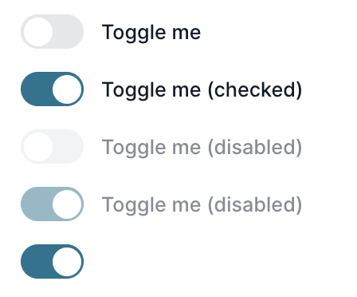
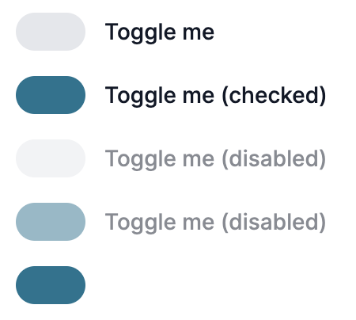

This repo demonstrates an issue with the rendering of the `ToggleSwitch` component in flowbite-react.

The expected rendering is based on [the documentation](https://flowbite-react.com/docs/components/forms#toggle-switch) and should look like:


However, it looks like this instead:


To reproduce, start the server:
```
npm install
npm run dev
```